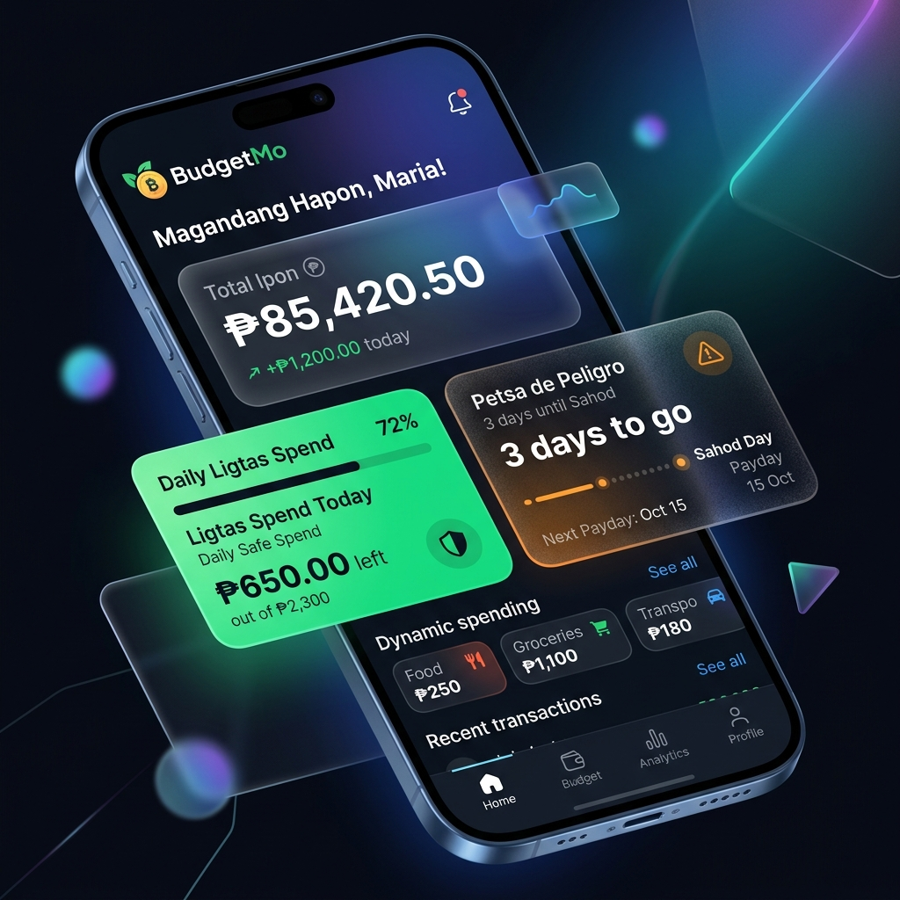

# 💰 BudgetMo

**"Kamusta, tipid tayo today?"**

BudgetMo is a premium, Filipino-centric expense tracking and savings app designed to help you navigate the unique financial landscape of living in the Philippines. From managing your daily "karinderya" expenses to surviving "Petsa de Peligro," BudgetMo is your ultimate *alkansya* digital partner.



## ✨ Features

- **🛡️ Daily Ligtas Spend**: Automatically calculates how much you can safely spend per day based on your remaining budget and days until sahod.
- **🚨 Petsa de Peligro Tracker**: A specialized countdown to your next payday (15th or 30th) with adaptive alerts.
- **📈 Total Ipon Monitoring**: See your total savings at a glance with a clean, glassmorphic dashboard.
- **🎯 Ipon Challenges**: Built-in 52-week challenge and emergency fund trackers to keep your savings on track.
- **🇵🇭 Localized Context**: Categorize expenses using familiar terms like *Tricycle*, *Karinderya*, and *Pang-Gala*.

## 🚀 Tech Stack

- **Framework**: [Next.js 15+](https://nextjs.org/) (App Router)
- **Styling**: [Tailwind CSS 4](https://tailwindcss.com/)
- **Animations**: [Framer Motion](https://www.framer.com/motion/)
- **Icons**: [Lucide React](https://lucide.dev/)
- **Typography**: [Outfit](https://fonts.google.com/specimen/Outfit) (Display) & [Inter](https://fonts.google.com/specimen/Inter) (Body)

## 🛠️ Getting Started

First, install the dependencies:

```bash
npm install
```

Then, run the development server:

```bash
npm run dev
```

Open [http://localhost:3000](http://localhost:3000) with your browser to see the result.

## 🏗️ Project Structure

- `src/app/` - Next.js App Router pages and layouts.
- `src/components/` - Reusable UI components.
- `src/hooks/` - Custom React hooks for budget calculations.
- `docs/` - Documentation and media assets.

## 📄 License

This project is private and intended for personal use.

---
*Built with ❤️ for every Pinoy who wants to save more.*
